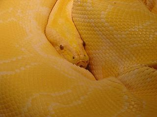
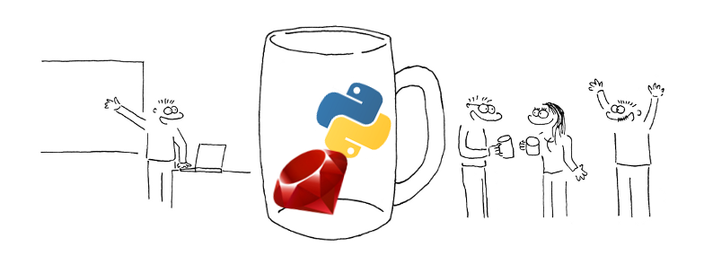
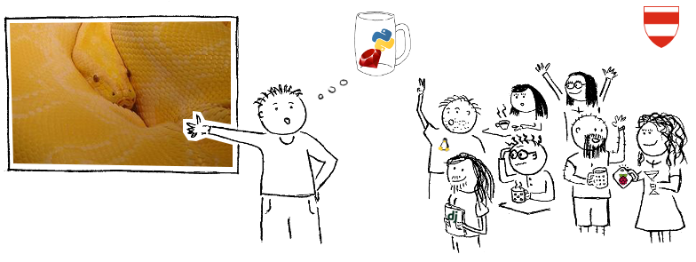

This creates header images for our events.

Usage:

    $0 IMAGE OUTPUT

Sample input and output images are included. The output was generated with:

    ./overlay.sh demo-input.jpg demo-output.png

If you don't like the overlay, you'll need to edit the script – change the filename and the window dimensions/position.

## Overlay images

You can find "official" overlay images in [`pyvec/resources`](https://github.com/pyvec/resources) repo, specificially in [the `Facebook Event Header` directory](https://github.com/pyvec/resources/tree/master/Design/Facebook%20Event%20Header).

## License

MIT. Feel free to use this!

## Example

### Input

(public domain image, from [Wikimedia Commons](http://commons.wikimedia.org/wiki/File:Albino_Burmese_python.jpg))

### Overlay

### Output

