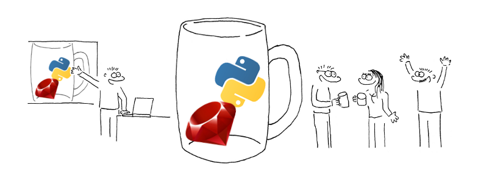

This creates header images for our events.

Usage:
    
    $0 IMAGE OUTPUT

Sample input and output images are included. The output was generated with:

    ./overlay.sh logo.png demo.png

If you don't like the overlay, you'll need to edit the script – change the filename and the window dimensions/position.

## Example

### Input

### Overlay

### Output

